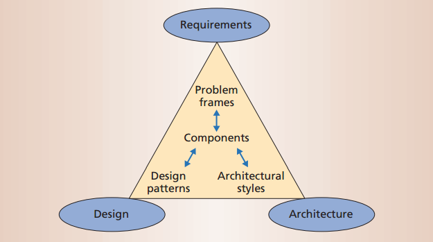

# Requirements Engineering
To be able to quantify the quality of community contributions, it needs to be known what the requirements are for the contributions in question. Then the contribution needs to be tested against this requirement in some way. If the requirement changes, the contribution needs to be changed as well to reflect this. This process needs to be structured to prevent it from getting too complex.

The field of requirements engineering is a part of systems and software engineering, and deals with structuring requirements. It involves systems modeling and the inception, identification, analysis, specification and management of requirements. However, it can be viewed in terms of two groups of activities, corresponding with the iterative and incremental nature of the process:
requirements development and requirement management {{"pandey2010effective" | cite}}. To consider these activities, first a definition of a software requirement has to be established.

## The definition of a software requirement
In the "Guide to the Software Engineering Body of Knowledge" (SWEBOK) the IEEE[^ieee] defines a software requirement as: 'a property that must be exhibited by something in order to solve some problem in the real world' {{"swebok14" | cite}}. Requirements can be imposed on the product as well as the process. An essential property of software requirements is that they are verifiable, either as an individual feature (functional requirement) or at the system level (non-functional requirement). In addition to this behavioral properties, requirements may have attributes such as a priority rating and a progression status.

## Requirements development

Discovering, analyzing, documenting and validating requirements are all part of the process of requirements development {{"pandey2010effective" | cite}}. This process is essential to defining a software architecture works as the end user expects. One of the activities related to requirements development is software testing.

## Requirements management

Throughout the software development process, a requirement may change. This change may affect other parts of the system, in turn affecting other requirements as well. Requirements management consists of activities related to managing these changes and tracing them to the corresponding parts of the system {{"pandey2010effective" | cite}}. An example of an activity that are related to traceability is issue tracking.

## The Twin peaks model

In order to ensure a software implementation adheres to its requirements and keeps doing so, an iterative workflow is required. An example of an iterative model is the Twin Peaks model. Requirements and an architectural specification are developed concurrently, while continually separating problem structure and specification from those of the solution {{"nuseibeh2001weaving" | cite}}. Combining this approach with problem frames {{"hall2002relating" | cite}} allows for a structural decomposition of problems into smaller problems that can be solved with a modular solution. The final workflow looks like this {{"nuseibeh2001weaving" | cite}}:

[^ieee]: http://www.ieee.org/
